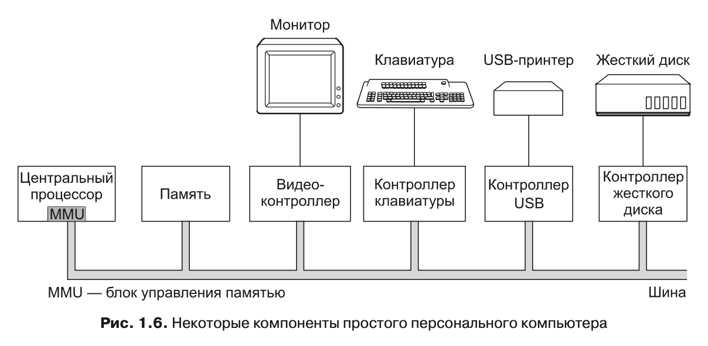
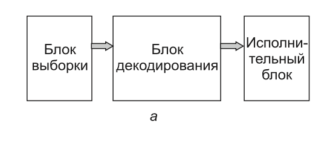
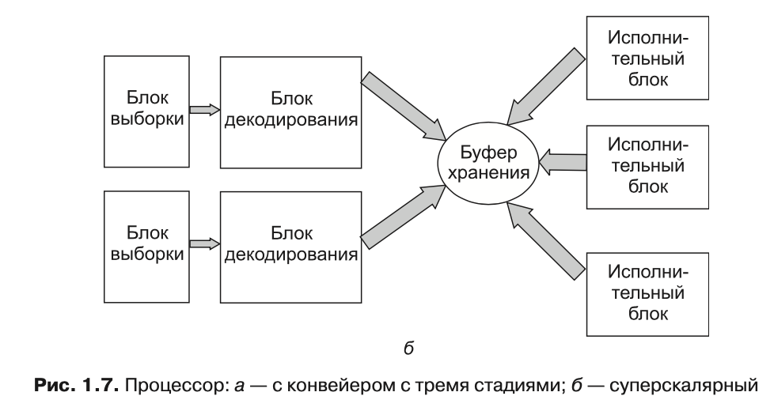

#Как устроен комп аппаратно

##Базовые компоненты

Концептуально простой персональный компьютер можно представить в виде модели, аналогичной изображенной на рис. 1.6.

>  **Центральный процессор, память и устройства ввода-вывода соединены системной шиной, по которой они обмениваются информацией друг с другом**

Современные персональные компьютеры имеют более сложную структуру и используют несколько шин, которые мы рассмотрим чуть позже
***

## Процессоры

> Центральный процессор — это «мозг» компьютера.
> Он выбирает команды из памяти и выполняет их.

*Обычный цикл работы центрального процессора выглядит так*:

1. Выборка из памяти первой команд
2. Ее декодирование для определения ее типа и операндов
3. Выполнение этой команды

Этот цикл повторяется до тех пор, пока не закончится программа. Таким образом программы выполняются.
***

>Для каждого типа центрального процессора существует определенный набор команд, которые он может выполнять. 

Поэтому x86 не может выполнять программы, написанные для ARM-процессоров, а те, в свою очередь, не в состоянии выполнять программы, написанные для x86.

### Регистры. Зачем?
* Они нужны для хранения основных переменных и промежуточных результатов. 
* Поскольку доступ к памяти для получения команды или данных занимает намного больше времени, чем выполнение команды, у всех центральных процессоров есть несколько собственных регистров.

#### Виды регистров, доступных программисту
* **счетчик команд**. содержит адрес ячейки памяти со следующей выбираемой командой. После выборки этой команды счетчик команд обновляется, переставляя указатель на следующую команду.
* **указатель стека** . В стековом фрейме процедуры хранятся ее входные параметры, а также локальные и временные переменные, не содержащиеся в регистрах
* **слово состояния программы — PSW (Program Status Word).**  В этом регистре содержатся биты кода условия, устанавливаемые инструкциями сравнения, а также биты управления приоритетом центрального процессора, режимом (пользовательским или ядра) и другие служебные биты. 

#### Зачем операционке знать о состоянии регистров

При временном мультиплексировании центрального процессора операционная система может часто останавливать работающую программу, чтобы запустить или возобновить работу другой программы.

>При каждой остановке работающей программы операционная система должна **сохранять состояние всех регистров, чтобы восстановить его** при последующем возобновлении работы этой программы.

### Схемы работы процессора:конвейер и суперскаляр

1. У процессора могут быть отдельные блоки для выборки, декодирования и выполнения команд, тогда во время выполнения команды n он сможет декодировать команду n + 1 и осуществлять выборку команды n + 2. Подобная организация работы называется конвейером

2. Одновременно выбираются две и более команды, которые декодируются и помещаются в буфер хранения, в ко- тором ожидают возможности своего выполнения. Как только исполнительный блок становится доступен, он обращается к буферу хранения за командой, которую может выполнить, и если такая команда имеется, извлекает ее из буфера, а затем выполняет. 

