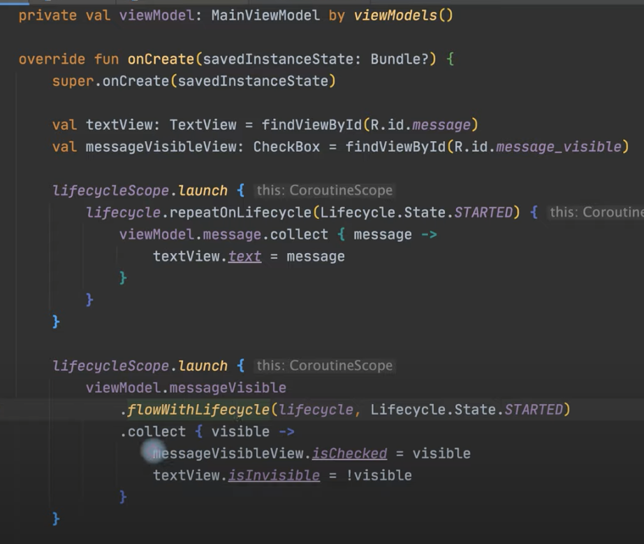

# RxJava2 to Coroutines Migration Guide


```kotlin
val coroutinesVersion = "1.5.0"

dependencies { 
  implementation("org.jetbrains.kotlinx:kotlinx-coroutines-core-jvm:$coroutinesVersion")
  implementation("org.jetbrains.kotlinx:kotlinx-coroutines-reactive:$coroutinesVersion")
  implementation("org.jetbrains.kotlinx:kotlinx-coroutines-reactor:$coroutinesVersion")
  implementation("org.jetbrains.kotlinx:kotlinx-coroutines-rx3:$coroutinesVersion")
```


### How code will look like finally in ViewModel





### Useful links regarding MVI

- [Revisiting unidirectional data flows on Android with Kotlin’s SharedFlow and StateFlow](https://argenkiwi.medium.com/revisiting-unidirectional-data-flows-on-android-with-kotlins-sharedflow-and-stateflow-92fb74e17983)
- [android-mvi-kotlin-coroutines-flow](https://quickbirdstudios.com/blog/android-mvi-kotlin-coroutines-flow/)
- [mvi-architecture-with-kotlin-flows-and-channels](https://proandroiddev.com/mvi-architecture-with-kotlin-flows-and-channels-d36820b2028d)